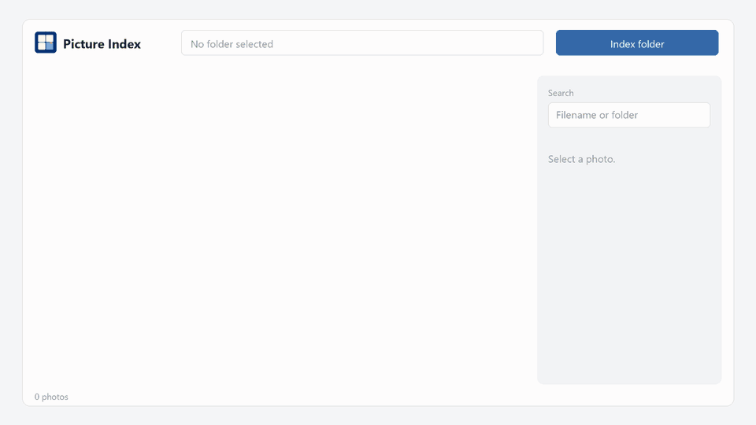

# Picture Index

Local search for photos copied off a phone. Point it at a folder. It walks every subfolder, makes a thumbnail, reads the date from the photo, and lets you search by filename, folder, and date.



The page binds to `127.0.0.1` only. Nothing is uploaded. The index stays in a `data` folder next to the app.

OCR for text printed in the picture, and tags for what the picture shows, are not in this version yet. Search covers the filename, the folder name, and the date the phone saved.

Supported files: JPG, JPEG, PNG, WEBP, HEIC, GIF, BMP.

## What you need

- Windows 10 or 11
- [Python 3.10 or newer](https://www.python.org/downloads/windows/), 64-bit
- Git, if you clone the repository rather than downloading a zip

During the Python install, enable **Add python.exe to PATH**.

Check both tools in PowerShell:

```powershell
python --version
git --version
```

`python --version` should print `Python 3.10` or a higher 3.x version. If `python` is not recognized, try `py --version`. The `py` launcher is fine for every command below: use `py -m venv .venv` instead of `python -m venv .venv`.

## Install

Clone the repository and enter the folder:

```powershell
git clone https://github.com/Dor-Peretz/Picture-Index.git
cd Picture-Index
```

Create a virtual environment in the project folder. This keeps Picture Index's packages separate from other Python apps on the machine.

```powershell
python -m venv .venv
```

Turn the environment on:

```powershell
.\.venv\Scripts\Activate.ps1
```

The prompt should then start with `(.venv)`. If PowerShell blocks the script with an execution-policy error, run this once for your user account, then try the activate command again:

```powershell
Set-ExecutionPolicy -Scope CurrentUser RemoteSigned
```

Install the libraries the app imports (FastAPI, Uvicorn, Pillow, and HEIC support):

```powershell
python -m pip install --upgrade pip
pip install -r requirements.txt
```

## Start

From the same folder, with `(.venv)` still active:

```powershell
python -m app
```

The app listens on [http://127.0.0.1:8766](http://127.0.0.1:8766) and opens that address in your browser. If port 8766 is already taken, it tries the next free port up through 8785 and prints the address it actually bound.

Leave that PowerShell window open while you use the app. Closing it, or pressing `Ctrl+C` there, stops Picture Index.

To choose a port yourself:

```powershell
$env:PICTURE_INDEX_PORT = "8770"
python -m app
```

## Use it

1. Click **Browse** and choose the folder that holds the phone backup, or paste the path into the box at the top.
2. Click **Index folder**. The first pass reads every image in that folder and its subfolders, writes a thumbnail, and stores the date from the photo when the phone saved one.
3. Use the panel on the right to search by filename or folder, and to limit results by folder or by the date taken.
4. Click a thumbnail to see its details. **Open file** opens the original in Windows.

A later index of the same folder skips files whose size and modified time have not changed. Photos removed from disk are dropped from the index.

## Where files are stored

Running from source keeps everything inside the project:

| Path | What it is |
|---|---|
| `data/catalog.db` | The search index |
| `data/thumbs/` | JPEG thumbnails |
| `data/settings.json` | The last folder you indexed |
| `data/picture-index.log` | Startup and scan log |

`data/` is not part of git. Deleting it clears the index and thumbnails. Your original photos are not in that folder and are not modified.

## Start it again later

```powershell
cd Picture-Index
.\.venv\Scripts\Activate.ps1
python -m app
```

You do not need to run `pip install` again unless `requirements.txt` changed.

## Update

```powershell
cd Picture-Index
git pull
.\.venv\Scripts\Activate.ps1
pip install -r requirements.txt
python -m app
```

## If it does not start

**`python` is not recognized.** Install Python 3.10+ with **Add python.exe to PATH** checked, open a new PowerShell window, and try again. Or call `py -m venv .venv` and `py -m app`.

**Activate.ps1 cannot be loaded.** Run `Set-ExecutionPolicy -Scope CurrentUser RemoteSigned`, then `.\.venv\Scripts\Activate.ps1` again.

**`No module named app`.** The command was not run from the `Picture-Index` folder, or the virtual environment is not active. `cd` to the clone and activate `.venv` first.

**The browser opens and the page does not load.** Read the address printed in the PowerShell window. Another program may already be using 8766, so Picture Index moved to the next free port.

**A HEIC photo fails to index.** Confirm `pip install -r requirements.txt` finished without errors. HEIC support comes from the `pillow-heif` package in that file. The photo still gets a row in the index, with the error shown on its detail panel.
